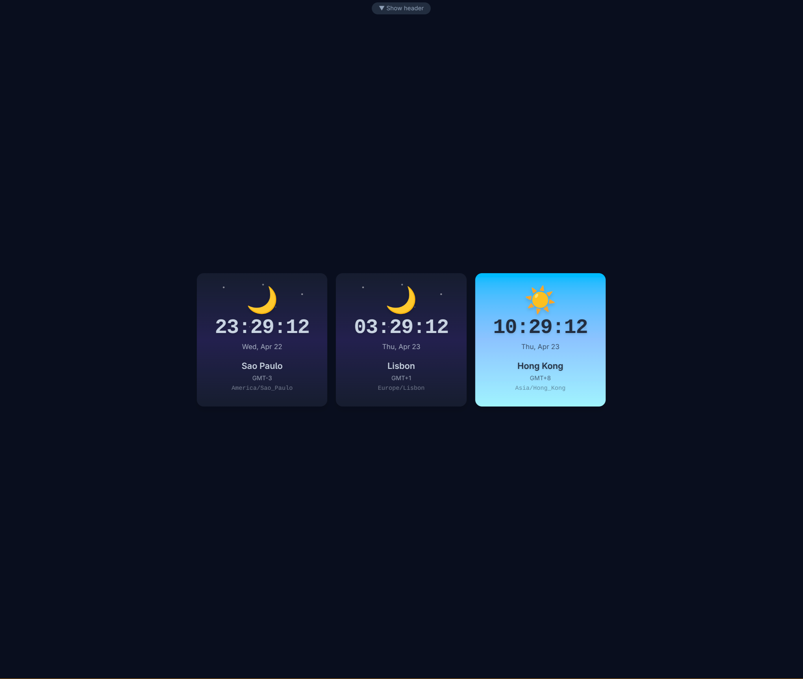

# 🌍 Timezone Monitor



A beautiful, real-time timezone tracker built with Svelte 5 and Tailwind CSS. Keep an eye on the time across multiple locations around the world with dynamic sky themes that reflect the actual time of day.

## Features

- **Real-time Updates** — Time updates every second across all displayed timezones
- **Dynamic Sky Themes** — Each timezone card displays a gradient background and icon that changes based on the local time (dawn, morning, afternoon, dusk, night)
- **Searchable Timezone Picker** — Quickly find and add any IANA timezone from a searchable, grouped list
- **Drag & Drop Reordering** — Rearrange your timezone cards in edit mode
- **Persistent Storage** — Your selected timezones are saved to localStorage
- **Responsive Design** — Works great on desktop and mobile devices
- **Dark Mode Support** — Automatically adapts to your system's color scheme
- **Collapsible Header** — Hide the header for a cleaner, more compact view

## Getting Started

### Prerequisites

- Node.js 18+
- npm or pnpm

### Installation

```bash
# Clone the repository
git clone <repository-url>
cd timezone-monitor

# Install dependencies
npm install

# Start the development server
npm run dev
```

Open [http://localhost:5173](http://localhost:5173) in your browser.

### Build for Production

```bash
npm run build
npm run preview
```

## Usage

1. **Add Timezones** — Click the "+ Add" button to open the timezone picker and search for a location
2. **Remove Timezones** — Click "Edit" to enter edit mode, then click the ✕ button on any card
3. **Reorder Timezones** — In edit mode, drag and drop cards to rearrange them
4. **Hide Header** — Click the ▲ button to collapse the header for a minimal view

## Tech Stack

- [Svelte 5](https://svelte.dev/) — Frontend framework with runes
- [Vite](https://vitejs.dev/) — Build tool and dev server
- [Tailwind CSS 4](https://tailwindcss.com/) — Utility-first CSS framework

## Project Structure

```
src/
├── App.svelte              # Main application component
├── main.js                 # Application entry point
├── app.css                 # Global styles
└── lib/
    ├── TimezoneColumn.svelte   # Individual timezone card
    ├── TimezonePicker.svelte   # Modal for adding timezones
    ├── HourTimeline.svelte     # 24-hour visual timeline
    ├── timezones.js            # Timezone utilities
    ├── sky.js                  # Sky theme calculations
    └── storage.js              # localStorage helpers
```

## License

MIT
